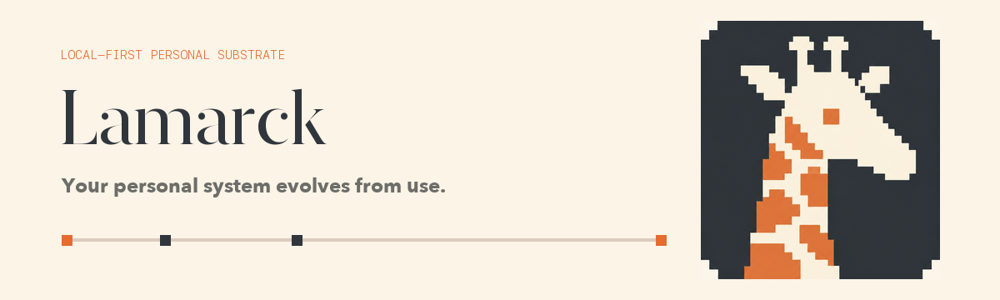

<p align="center">
  <br />
  <picture>
    
  </picture>
</p>

<h1 align="center">Lamarck</h1>

<p align="center">
  An open-source, local-first environment for personal software that evolves
  with you—so apps, automations, and AI can be created, replaced, and improved
  around one system you own.
</p>

<p align="center">
  <strong>A personal system that evolves with you.</strong>
</p>

<p align="center">
  <a href="https://lamarck.ai"></a>
  <a href="https://discord.gg/CPQt6UDqZX"></a>
  
  
  
</p>

<p align="center">
  <a href="https://lamarck.ai/docs"><strong>Docs</strong></a>
  ·
  <a href="#quick-start"><strong>Quick start</strong></a>
  ·
  <a href="#what-works-today"><strong>Current status</strong></a>
  ·
  <a href="#how-it-works"><strong>How it works</strong></a>
</p>

---

## Why Lamarck

This probably isn't your first personal system. Every habit tracker, planner,
journal, or second brain starts empty. You spend months shaping it around your
life, then outgrow it—and the next one asks you to start over.

Vibe coding has made personal software easy to create and replace. The
interface can now evolve as quickly as your needs do; your history should not
reset with it. Lamarck keeps that history in one local timeline that every new
app can inherit.

## Vision

Lamarck's long-term goal is a personal system that can evolve with one person
for decades.

I believe self-improvement should not become another job. AI can carry the
overhead: remembering what happened, connecting patterns, reviewing progress,
and improving the system around you. You decide what matters and what a better
life means—then spend your time living it.

## What works today

| Area | Current state |
|---|---|
| **Desktop shell** | Pages, data views, workspace apps, source editor, activity, and connector UI |
| **Owned history** | Append-only events, Markdown-backed documents, and SQL-derived state |
| **Core runtime** | Local Node runtime with a dedicated Guard process |
| **App model** | Host-bound app identity, declared write grants, UI/services/jobs |
| **App sandbox** | Apps run in a shared Linux Capsule VM: bytes cross the verified, digest-bound Guest image as immutable blobs and run under the in-guest runc supervisor, with no Host fallback |
| **Connector runtime** | Install/remove, scheduling, auth plumbing, encrypted credentials, and trust primitives |
| **Secrets** | Electron safeStorage plus encrypted external credentials |

## Quick start

### Requirements

- macOS 14+ on Apple silicon
- Xcode 16+ command-line tools
- Node.js 24.12+
- npm 11.16.0

### Run Lamarck from source

```bash
git clone https://github.com/adiabatichq/lamarck.git
cd lamarck
npm ci

# Fetch and verify the pinned Linux Guest
node scripts/fetch-guest-release.mjs

# Build the macOS VM helper and stage the Capsule resources
npm run capsule-vm:build:macos

npm start
```

The Guest fetch verifies every downloaded artifact against the repository pin.
The Capsule build produces an ad-hoc-signed local VM helper and stages the
Guest into the Desktop resources. `npm start` then builds the canonical
production Desktop output and launches it locally.

On first launch, Lamarck creates a workspace at:

```text
~/Lamarck
```

The Electron shell starts the dedicated Node Guard and Node Core services
automatically.

### Useful commands

```bash
# Build and run the production Desktop locally
npm start

# Build without launching
npm run build

# Run build, typecheck, tests, and release-contract checks
npm run verify

# Development mode with Vite HMR
npm run dev

# Core tests
npm --workspace @lamarck/core run test

# Shell tests
npm --workspace @lamarck/shell run test

# Capsule/System SDK/VM protocol suite
npm run capsule:test
```

### Your first five minutes

After Lamarck opens:

1. Explore the starter workspace and its pages.
2. Inspect the local data views and event history.
3. Open one of the example workspace apps.
4. Look at its `manifest.json` and declared write grants.
5. Change or build something without replacing the history underneath.

## How it works

Lamarck separates the history you own from the software that interprets it.

```text
Sources and actions
        ↓
D0 · append-only events
        ↓
D1 · Markdown documents  +  D2 · SQLite tables
        ↓
Apps · automations · AI workflows
```

| Layer | Role |
|---|---|
| **D0 · Events** | Append-only evidence of what happened, with stable provenance |
| **D1 · Documents** | Human-editable narrative, materialized as Markdown |
| **D2 · Tables** | Structured current state and derived read models |
| **Control plane** | Connector, credential, scheduler, and runtime state kept outside the personal substrate |

Events stay. Documents, tables, apps, and interfaces can evolve around them.

Three runtime boundaries keep that model honest:

- **Guard** owns managed personal-data writes and makes them attributable,
  permissioned, and auditable.
- **App Capsule** runs app workloads inside a Linux Guest; apps reach Lamarck
  through the bounded System SDK rather than opening the database directly.
- **Connectors** are explicitly configured trusted extensions that turn
  external signals into Sources without exposing raw credentials to runners.

The full contracts live in the technical docs:

| Goal | Start here |
|---|---|
| Understand the architecture | [System model](https://lamarck.ai/docs/system-model/) |
| Understand the durable data model | [Substrate](https://lamarck.ai/docs/substrate/) and [data contracts](https://lamarck.ai/docs/data/) |
| Build an app | [App Runtime](https://lamarck.ai/docs/apps/) and [interfaces](https://lamarck.ai/docs/modules/interfaces/) |
| Add an integration | [Connector Runtime](https://lamarck.ai/docs/connectors/) and [credentials](https://lamarck.ai/docs/modules/credential/) |
| Review authority and lifecycle boundaries | [Authority & Guard](https://lamarck.ai/docs/modules/authority/) and [Control Plane](https://lamarck.ai/docs/modules/control-plane/) |

## Repository map

```text
lamarck/
├── desktop/
│   ├── capsule/           Guest protocol, OCI policy, and isolation model
│   ├── capsule-guest/     Buildroot Guest image and in-guest supervisor
│   ├── capsule-vm-macos/  macOS VM host helper
│   ├── core/              Core, Guard, connectors, credentials, CLI
│   ├── shell/             Electron + React desktop shell
│   ├── system-sdk/        Browser and Node app SDK
│   └── template/          Starter workspace, apps, and connectors
├── scripts/               Build, verification, packaging, release
└── .github/               Public CI and package publishing
```

## Community

For reproducible bugs, open a GitHub issue. For workflow ideas and broader
discussion, [join the Discord](https://discord.gg/CPQt6UDqZX).

## Development

Run the standalone Core and Guard pair:

```bash
export LAMARCK_CORE_TOKEN="..."
export LAMARCK_VAULT_KEY="..."

npm --workspace @lamarck/core run dev -- /path/to/workspace
```

Build and test:

```bash
npm run build
npm run verify
```

Package a patch:

```bash
npm run package:patch
```

## OpenAI Build Week

Lamarck was already underway when OpenAI Build Week came along. I used the
week to turn one of its hardest pieces—the App Capsule—from a design into a
working macOS runtime.

The App Capsule grew from sandbox requirements shaped by Lamarck's product
philosophy into a workload model covering builds, runtime state, identity,
guarded data access, dependency reuse, and cleanup. Codex with GPT-5.6 carried
that model across TypeScript, a Swift VM host, a verified Buildroot Linux
Guest, runc, and the Host-bound System SDK.

That was far more low-level plumbing than I expected to finish in a week.
GPT-5.6 is a big reason it got done.

Also during Build Week, we shipped:

- a more durable personal substrate, with transactional migrations and
  reconciliation between D1 and its Markdown working tree
- structured D0 ingestion for coding-agent transcripts, alongside a hardened
  Connector runtime
- the runtime and starter workspace in the public repository, backed by
  technical docs, CI, SDK publishing, and Guest/Desktop alpha release pipelines

[Build Week commits](https://github.com/adiabatichq/lamarck/commits/main/?since=2026-07-13&until=2026-07-22)
· reproduce the checks with `npm run verify`.

## Name

Lamarck is a metaphor: systems can keep what they acquire from use.

The giraffe is a playful reference to the historical story associated with
Jean-Baptiste Lamarck—and a reminder that a personal system should change
with the life that uses it.

## License

Lamarck is licensed under the [Apache License 2.0](LICENSE).
